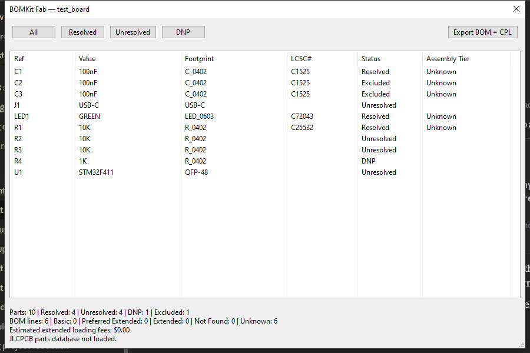

# BOMKit

BOMKit is a KiCad BOM sourcing and supply-chain suite with three products:

- `bomkit-fab`: KiCad `pcbnew` plugin for JLCPCB-ready BOM/CPL export
- `bomkit-dashboard`: persistent BOM workspace with JLC fee intelligence and saved sourcing decisions across revisions
- `bomkit-parts`: HTTP library server for curated KiCad parts

This repository currently focuses on shipping `bomkit-fab` first: a KiCad plugin that generates JLCPCB-ready BOM and CPL files with field normalization, rotation correction, and assembly-cost visibility.

BOMKit Fab is intentionally the first wedge, not the full end-state. The broader BOMKit direction is a more process-aware sourcing and manufacturing workflow for KiCad: catching part, sourcing, and manufacturability problems earlier in the design cycle instead of only at final export time.

Tested on KiCad 9.0.8 and KiCad 10.0.0.

## BOMKit Fab

BOMKit Fab is a KiCad ActionPlugin for manufacturing handoff. It reads the currently loaded PCB, resolves LCSC part numbers from common custom-field aliases, applies rotation correction rules, and exports:

- `{project}_BOM_JLCPCB.csv`
- `{project}_CPL_JLCPCB.csv`

It also includes:

- field alias normalization for LCSC / MPN / manufacturer fields
- S-expression `.kicad_pcb` parsing fallback for tests and CLI-style use
- JLCPCB part-library classification and loading-fee estimation
- a wxPython dialog with sortable/filterable parts view
- project-level `rotations_custom.csv` overrides

## BOMKit Dashboard

BOMKit Dashboard is the web companion to BOMKit Fab.

What it does:
- imports BOMKit Fab export CSVs and KiCad Symbol Fields CSVs
- persists projects, revisions, notes, local offers, and locked choices
- preserves row cleanup and sourcing decisions across revisions
- shows JLC Basic / Preferred Extended / Extended tiering and loading-fee impact
- exports cleaned dashboard CSVs and JLC-ready CSVs on paid tiers

Pricing tiers:
- Free — 1 project, up to 50 rows, no CSV export
- Solo — $15/mo, unlimited projects and CSV export
- Pro — $29/mo, everything in Solo plus future share links

Current deploy status:
- app code builds successfully locally
- production Vercel deploy is currently blocked by an invalid/expired Vercel token in the Windows-native environment

How it connects to BOMKit Fab:
- BOMKit Fab generates the manufacturing handoff files in KiCad
- BOMKit Dashboard is where those BOMs become persistent, revision-aware workspaces

## Repository layout

```text
bomkit/
├── SPEC.md
├── README.md
├── LICENSE
├── bomkit-fab/
│   ├── __init__.py
│   ├── plugin.py
│   ├── board_adapter.py
│   ├── sexp_parser.py
│   ├── field_resolver.py
│   ├── bom_exporter.py
│   ├── cpl_exporter.py
│   ├── rotations.py
│   ├── rotations.csv
│   ├── jlcpcb_classifier.py
│   ├── cost_estimator.py
│   ├── ui/
│   ├── tests/
│   ├── metadata.json
│   └── icon.png
├── bomkit-dashboard/
└── bomkit-parts/
```

## Installation

### Option 1: KiCad PCM

When the package is published through KiCad PCM, install `BOMKit Fab` from the Plugin and Content Manager.

### Option 2: Manual install from the repo

Copy or symlink `bomkit-fab/` into your KiCad plugins directory.

Typical KiCad 10 plugin directory on Windows:

```text
%APPDATA%/kicad/10.0/3rdparty/plugins/
```

Typical KiCad 9 plugin directory on Windows:

```text
%APPDATA%/kicad/9.0/3rdparty/plugins/
```

In WSL on this machine, those correspond to:

```text
/mnt/c/Users/burba/AppData/Roaming/kicad/10.0/3rdparty/plugins/
/mnt/c/Users/burba/AppData/Roaming/kicad/9.0/3rdparty/plugins/
```

Example manual install from the repo root:

```bash
mkdir -p /mnt/c/Users/burba/AppData/Roaming/kicad/10.0/3rdparty/plugins
ln -s /mnt/c/Users/burba/bomkit/bomkit-fab \
  /mnt/c/Users/burba/AppData/Roaming/kicad/10.0/3rdparty/plugins/bomkit-fab
```

If symlinks are inconvenient on Windows, copy the directory instead.

### Option 3: Manual install from packaged zip

A PCM-ready package zip is produced at:

```text
packages/bomkit-fab-v0.1.0-pcm.zip
```

To install manually:
1. unzip the archive
2. copy the contained `bomkit-fab/` directory into your KiCad `3rdparty/plugins/` directory
3. restart KiCad and confirm `BOMKit Fab` appears in pcbnew

## Usage

1. Open your board in KiCad `pcbnew`
2. Click the `BOMKit Fab` toolbar button
3. Review the parts table and assembly summary
4. Click `Export BOM + CPL`
5. Upload the generated CSV files to JLCPCB

Generated files:

- BOM: `*_BOM_JLCPCB.csv`
- CPL: `*_CPL_JLCPCB.csv`

## How BOM fields are resolved

### LCSC aliases

The plugin resolves LCSC numbers using common custom-field aliases, including:

- `LCSC`
- `LCSC Part Number`
- `LCSC_Part`
- `lcsc`
- `lcsc_part`
- `lcsc_part_number`
- `jlcpcb_part`
- `jlc`

### MPN aliases

The plugin also normalizes MPN aliases, including:

- `mpn`
- `pn`
- `p#`
- `part_num`
- `manf#`
- `mfg#`
- `mfr#`
- `part_number`
- `manufacturer_part`
- `mfr_part`
- `mfg_part_number`
- `manf_pn`

## Rotation database

Default rotation corrections live in:

```text
bomkit-fab/rotations.csv
```

Project-specific overrides can be added with:

```text
<project directory>/rotations_custom.csv
```

The custom file uses the same two-column CSV format:

```csv
# Pattern (regex), Rotation Offset (degrees, CCW positive)
^QFN-,180
^USB_C,0
```

Override rules are loaded before the built-in database, so project-local entries take priority.

## Testing

From the repo root:

```bash
pytest -q bomkit-fab/tests
```

Useful targeted test runs:

```bash
pytest -q bomkit-fab/tests/test_sexp_parser.py
pytest -q bomkit-fab/tests/test_field_resolver.py
pytest -q bomkit-fab/tests/test_rotations.py
pytest -q bomkit-fab/tests/test_bom_exporter.py
pytest -q bomkit-fab/tests/test_cpl_exporter.py
pytest -q bomkit-fab/tests/test_jlcpcb_classifier.py
pytest -q bomkit-fab/tests/test_ui_imports.py
```

## Screenshots

BOMKit Fab running inside KiCad on the fixture board:



This screenshot was captured from a real KiCad run on Windows after loading the fixture board and opening the plugin dialog.

## Contributing

Contributions are welcome.

Recommended workflow:

1. Read `SPEC.md`
2. Create a focused branch
3. Add tests first when practical
4. Keep plugin/runtime code separate from evaluator/test fixtures
5. Run the `bomkit-fab/tests` suite before submitting changes

Areas especially worth contributing:

- more rotation rules verified against real assembly orders
- richer KiCad 10 variant support
- broader JLCPCB CSV compatibility
- improved UI polish inside KiCad
- dashboard and parts-server scaffolding

## License

MIT — see `LICENSE`.
